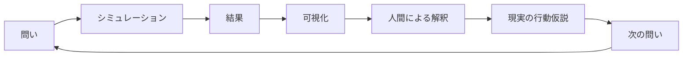
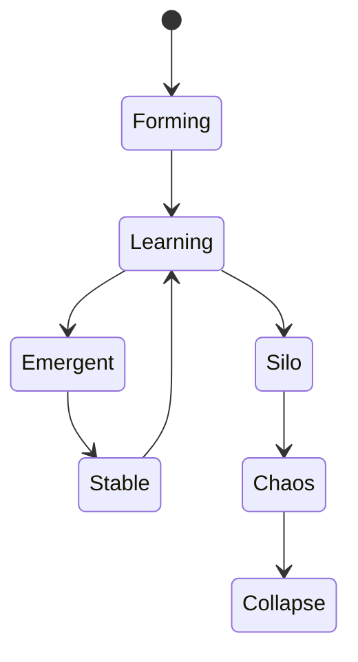
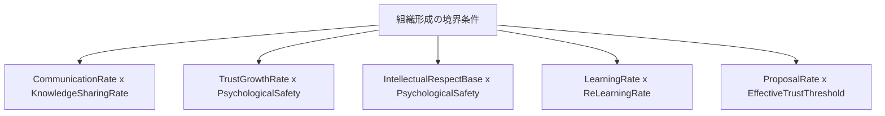
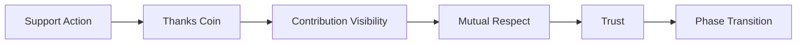
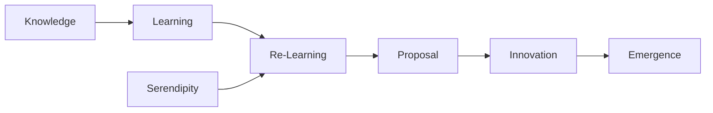
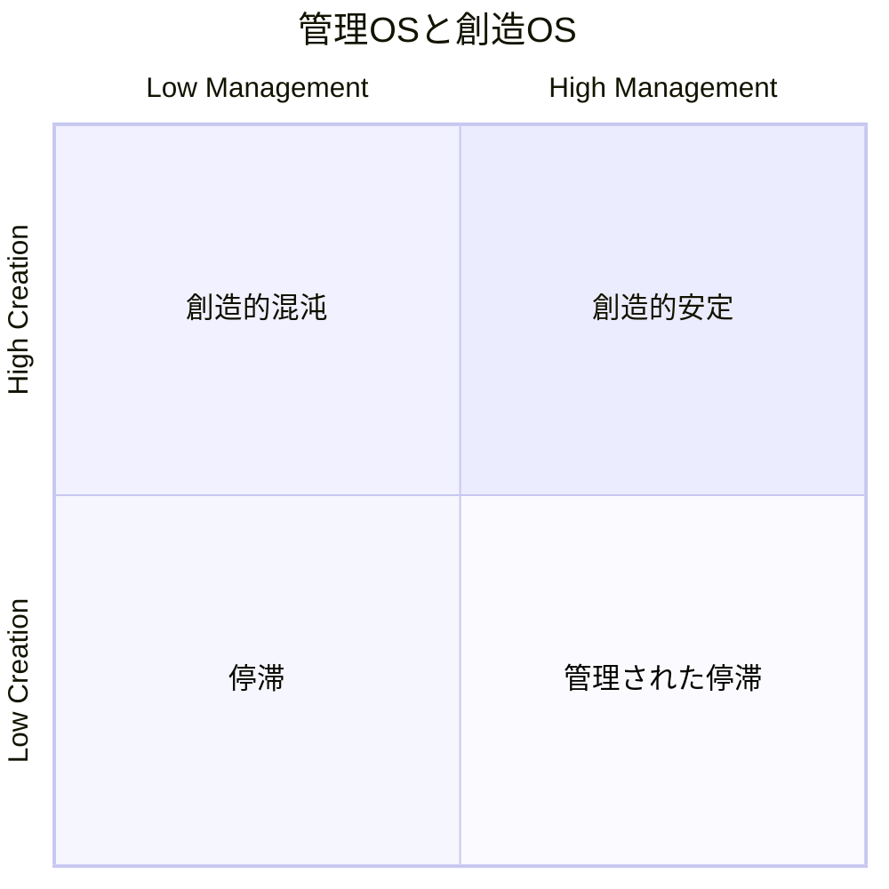
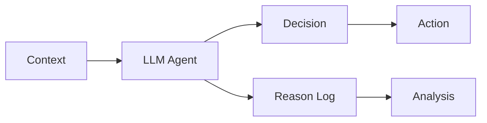
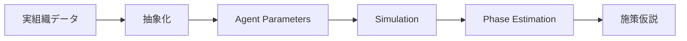
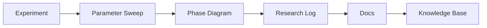
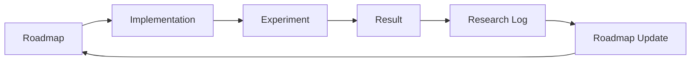

# ROADMAP

## 目的

本ロードマップは、Emergent Organization Simulator の開発・研究の方向性を示す。

本プロジェクトは、単なる組織シミュレーションアプリではなく、創発工学に基づいて「組織がどの条件で学習・協調・創発・分断・崩壊へ向かうのか」を探索する研究プラットフォームである。

特に本ロードマップでは、「組織形成の境界条件」を明らかにすることを中心に置く。

---

## 基本方針

本プロジェクトでは、シミュレーションを未来予測のための装置としてではなく、人間が現実の組織を具体的にイメージし、仮説を立て、施策を考えるための実験装置として扱う。

重要なのは、AIが出した結果をそのまま信じることではない。

重要なのは、その結果を現実に照らし合わせ、「この条件なら何が起こりそうか」「どの行動が組織状態を変えそうか」を人間が考えられるようにすることである。



---

## 研究上の中心テーマ

本プロジェクトで優先して検証する中心テーマは以下である。

|テーマ|検証したいこと|
|---|---|
|Trust|信頼は創発の原因なのか、相互作用の結果なのか|
|Communication|組織がLearning相へ入るための入口になるか|
|Knowledge Sharing|知識共有がEmergent相への遷移条件になるか|
|Re-Learning|単なる学習ではなく、知識の再構成が必要か|
|Serendipity|偶発的な接続が創発に与える影響|
|Mutual Respect|相互尊重がStable相を支えるか|
|Intellectual Respect|知的尊重が創造的衝突や破壊的創発を生むか|
|Psychological Safety|安定的な協力・相談・提案を促進するか|
|Thanks Coin|見えにくい支援・貢献・敬意を可視化できるか|
|管理OS / 創造OS|管理と創造を別軸で評価できるか|

---

## Phase 0: 研究基盤の整備

### 目的

GitHubリポジトリを、単なるコード置き場ではなく、創発工学の研究基盤として整備する。

### 実施項目

- `docs/` の整備
- `research/` の整備
- `papers/` の整備
- `samples/` の整備
- `README.md` の整備
- `CHANGELOG.md` の整備
- `ROADMAP.md` の整備
- Mermaidによる構造図の整備

### 成果物

```text
docs/
  00_プロジェクト概要.md
  01_背景と参考文献.md
  02_創発工学とは.md
  03_シミュレーションモデル.md
  04_システム構成.md
  05_データベース設計.md
  06_パラメータ一覧.md
  07_実験方法.md
  08_実験結果.md

research/
  実験ノート

papers/
  参考文献メモ

samples/
  再現用パラメータ・結果
```

### 完了条件

- 研究背景、モデル、実験方法、結果記録の流れがGitHub上で追える
- コード、理論、実験、考察が分離して管理できる
- 外部の閲覧者が「何を研究しているのか」を理解できる

---

## Phase 1: 基本シミュレーションモデルの確立

### 目的

組織を複雑適応系として扱うための基本モデルを実装・安定化する。

### 実施項目

- Agentモデル
- Actionモデル
- Interactionモデル
- Trust更新
- Knowledge更新
- Communication記録
- Phase判定
- SimulationStep保存
- AgentAction保存
- TrustChange保存

### 対象Phase



### 完了条件

- StepごとのAgent行動が保存される
- Trust変化がAgent間ログとして追跡できる
- Phase遷移が時系列で確認できる
- 同一パラメータとRandomSeedで再現可能である

---

## Phase 2: 境界条件の探索

### 目的

どの条件で組織がLearning、Emergent、Stable、Silo、Chaos、Collapseへ遷移するかを調べる。

### 優先するパラメータ組み合わせ

|組み合わせ|目的|
|---|---|
|CommunicationRate × KnowledgeSharingRate|LearningからEmergentへの境界を見る|
|TrustGrowthRate × PsychologicalSafety|安定協調が生まれる条件を見る|
|IntellectualRespectBase × PsychologicalSafety|破壊的創発とChaosの境界を見る|
|LearningRate × ReLearningRate|学習と再学習の違いを見る|
|ProposalRate × EffectiveTrustThreshold|提案が受け入れられる条件を見る|



### 完了条件

- 主要パラメータのスイープが実行できる
- Phase DiagramまたはHeatmapで結果を確認できる
- 境界条件の仮説を `research/` に記録できる

---

## Phase 3: Respect / Thanks Coinモデル

### 目的

組織内の見えにくい支援・貢献・敬意を可視化し、創発への影響を検証する。

### 実施項目

- Mutual Respectモデル
- Intellectual Respectモデル
- Thanks Coinモデル
- Support Actionとの連動
- Contribution Visibility
- Respect Network
- Thanks Coin Flow可視化



### 検証したいこと

- 支援行動はTrust形成に寄与するか
- Thanks Coinは相互敬意を高めるか
- 見えにくい貢献を可視化すると組織Phaseは変わるか
- 指示を出さなくても、貢献可視化によって行動が改善するか

### 完了条件

- Thanks Coinの発生・流れ・影響が記録できる
- Mutual Respectとの関係が可視化できる
- Thanks Coinあり/なしの比較実験ができる

---

## Phase 4: 学習・再学習・セレンディピティ

### 目的

単なる知識蓄積ではなく、知識の再構成や偶発的接続が創発に与える影響を検証する。

### 実施項目

- LearningRate
- ReLearningRate
- Knowledge Recombination
- Serendipity Event
- Proposal Generation
- Innovation Index



### 検証したいこと

- LearningだけでEmergent相へ到達できるか
- Re-Learningがないと知識は停滞するか
- SerendipityはInnovationを増やすか
- 偶発的接続はChaosではなくEmergentへ向かう条件があるか

### 完了条件

- LearningとRe-Learningを分けて観測できる
- Serendipity Eventの有無でPhase比較ができる
- Innovation Indexが実験結果に反映される

---

## Phase 5: 管理OS / 創造OSの二軸評価

### 目的

組織を「管理できているか」だけで評価せず、「創造できているか」を別軸で評価する。

管理OSは、安定・統制・再現性を重視する。

創造OSは、探索・提案・知識再構成・創発を重視する。



### 実施項目

- ManagementScore
- CreationScore
- StabilityIndex
- InnovationIndex
- ProposalRate
- RuleDependence
- KnowledgeRecombination

### 検証したいこと

- 管理が強いだけではStableでもEmergentにならないのではないか
- 創造が強すぎるとChaosへ向かうのではないか
- 創造的安定に必要な条件は何か
- 管理OSと創造OSは同じ軸ではなく別軸で扱うべきではないか

### 完了条件

- 管理OSと創造OSを別指標として表示できる
- Phaseと二軸評価の関係を確認できる
- 「管理された停滞」と「創造的安定」を区別できる

---

## Phase 6: LLM Agent連携

### 目的

ルールベースAgentでは表現しにくい文脈依存の判断、提案、説明、協調行動をLLM Agentで扱う。

### 実施項目

- LLM AgentによるAction選択
- 行動理由の生成
- Agent間対話
- 仮説生成
- 実験結果の要約
- Research Log作成支援



### 検証したいこと

- LLM Agentは社会的行動を示すか
- ルールベースAgentと異なるPhase遷移を示すか
- 行動理由ログは人間の解釈に役立つか
- LLMの出力は創発工学における知識翻訳に使えるか

### 完了条件

- LLM Agentをオン/オフできる
- ルールベースAgentとの比較ができる
- LLMの行動理由が保存される

---

## Phase 7: 実組織データとの接続

### 目的

シミュレーション上の組織状態と、現実の組織データを比較し、行動仮説や施策検討に使えるかを検証する。

### 想定するデータ

- 社員間の性格・相性データ
- コミュニケーション傾向
- 協力関係
- 知識共有傾向
- 支援・相談の履歴
- 組織内の役割分布

### 実施項目

- 実組織データの匿名化
- Agentパラメータへの変換
- 現実組織のPhase推定
- 施策シミュレーション
- 行動提案の生成



### 検証したいこと

- ミクロな行動様式からマクロな組織状態を推定できるか
- 実際の組織改善に使える行動仮説を出せるか
- トップダウンで組織運営をしない場合でも、個人への示唆で組織が改善するか
- AIが提示した施策を人間が現実に置き換えられるか

### 完了条件

- 実データを安全に抽象化できる
- シミュレーション条件に変換できる
- 現実組織とシミュレーション結果を比較できる

---

## Phase 8: 創発工学プラットフォーム化

### 目的

Emergent Organization Simulator を、創発工学の実験・検証・知識翻訳プラットフォームとして発展させる。

### 実施項目

- 実験テンプレート
- 自動パラメータスイープ
- Phase Diagram自動生成
- Research Log生成支援
- GitHub Pages公開
- 論文・発表用データ出力
- AIによる次実験提案



### 完了条件

- 実験から研究ノートまでの流れが半自動化される
- Phase Diagramを中心に結果を比較できる
- GitHub上で研究プロセスを追跡できる
- 創発工学の実験基盤として再利用できる

---

## 現時点の優先順位

|優先度|項目|理由|
|---|---|---|
|高|docs整備|研究プロジェクトとしての文脈を明確にするため|
|高|TrustChangeログ|Agent間の相互作用を追跡するため|
|高|Phase判定|創発工学の中心指標となるため|
|高|Communication / Knowledgeログ|LearningからEmergentへの境界を見るため|
|高|Thanks Coin設計|相互敬意と貢献可視化の検証に必要なため|
|中|パラメータスイープ|境界条件探索に必要なため|
|中|Re-Learning / Serendipity|単なる学習を超えた創発を扱うため|
|中|管理OS / 創造OS|組織評価を一軸から二軸へ拡張するため|
|中|LLM Agent|社会的判断を扱う将来拡張として重要|
|低〜中|実組織データ連携|応用段階で重要だが慎重に扱う必要がある|

---

## 運用方針

本ロードマップは固定された計画ではない。

実験結果や新しい問いに応じて更新する。

本プロジェクトでは、予定通りに機能を作ることよりも、実験から得られた知見に応じてモデルを進化させることを重視する。



---

## まとめ

Emergent Organization Simulator のロードマップは、機能追加の一覧ではない。

これは、創発工学に基づいて組織形成の境界条件を探索するための研究計画である。

Trust、Communication、Knowledge、Respect、Psychological Safety、Thanks Coin、Re-Learning、Serendipity などの要素を段階的に実装・検証し、組織がどの条件で学習し、創発し、安定し、分断し、崩壊するのかを明らかにしていく。

最終的には、AIが生成した大量のシミュレーション結果を、人間が理解し、現実の組織設計や行動仮説へつなげるための知識翻訳プラットフォームを目指す。
