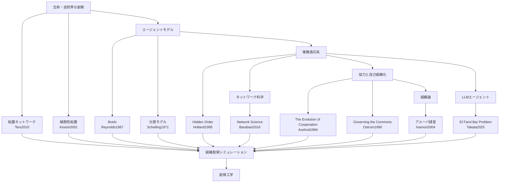

# 創発工学 参考文献マップ

## 文献一覧

|ID|分野|文献|参考にした点|
|---|---|---|---|
|Takata2025|LLM・社会シミュレーション|Emergent Social Dynamics of LLM Agents in the El Farol Bar Problem|LLMエージェントによる社会的創発|
|Tero2010|粘菌ネットワーク|Rules for Biologically Inspired Adaptive Network Design|局所ルールによる高効率ネットワーク形成|
|Kessin2001|細胞性粘菌|Dictyostelium|個体から集団への相転移、役割分担|
|Reynolds1987|エージェントモデル|Flocks, Herds, and Schools|局所ルールによる群れの創発|
|Schelling1971|社会シミュレーション|Dynamic Models of Segregation|局所判断から全体構造が生まれること|
|Holland1995|複雑適応系|Hidden Order|複雑適応系としての創発理解|
|Barabasi2016|ネットワーク科学|Network Science|信頼・情報伝播ネットワーク|
|Axelrod1984|協力・信頼|The Evolution of Cooperation|協力行動と信頼形成|
|Ostrom1990|自己組織化|Governing the Commons|自律分散型の秩序形成|
|Inamori2004|組織論|アメーバ経営|小集団・自律分散型組織運営|
