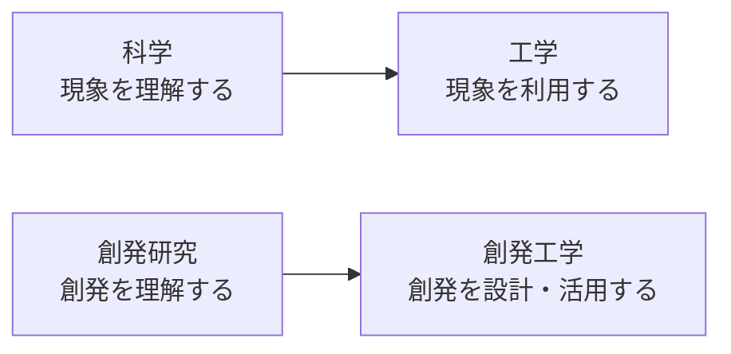
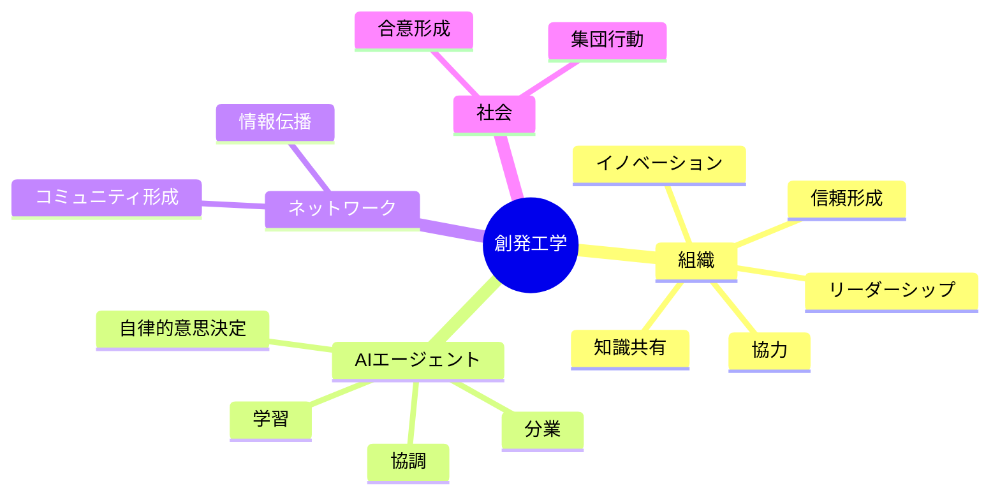
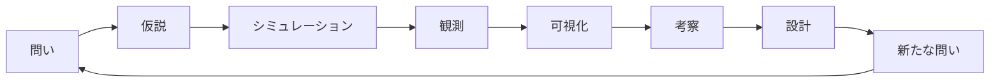
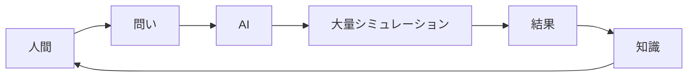
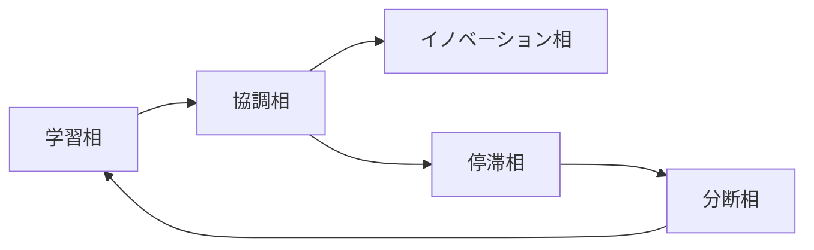
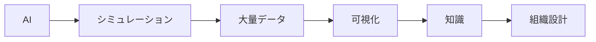

# 02_創発工学とは

## はじめに

創発（Emergence）は、個々の要素には存在しない性質が、多数の要素の相互作用によって全体として現れる現象である。

鳥の群れ、アリのコロニー、生態系、市場経済、都市、インターネット、企業組織など、多くの複雑なシステムは創発によって形成されている。

従来、創発は「観察するもの」「説明するもの」として研究されてきた。

本プロジェクトではさらに一歩進め、**創発を設計・予測・活用する対象**として扱う。この考え方を、本プロジェクトでは**創発工学（Emergence Engineering）**と呼ぶ。

---

# 創発工学の位置付け

創発工学は、創発を説明するだけではなく、設計・予測・活用することを目的とする。

---

# 創発工学の対象

本プロジェクトでは、創発を次のような対象へ応用することを想定している。

---

# 創発工学の基本サイクル

創発工学では、問いから始まり、新たな問いへ戻る研究サイクルを繰り返す。

従来の「理論→実験」だけではなく、AIによる大量シミュレーションを取り込んだ研究サイクルである。

---

# AIとの協奏

本プロジェクトでは、AIを単なるプログラム生成ツールとして扱わない。

AIと人間は、それぞれ異なる役割を担う。

AIは大量のシミュレーションやパターン発見を担当し、人間は問いを立て、結果を解釈し、理論化・応用を行う。

この協奏的ループによって創発工学は発展していく。

---

# 創発工学におけるシミュレーション

シミュレーションは未来を予測するためではなく、**条件を変えると何が起こり得るのか**を理解するための実験装置である。

航空機設計における風洞実験のように、実際の組織で試行錯誤する前に、多様な条件を安全かつ高速に検証することを目的としている。

---

# 創発相（Emergence Phase）

本プロジェクトでは、組織の状態を創発相として捉える。

創発工学では、どのような条件で相転移が起こるのかを重要な研究テーマとしている。

---

# 創発工学の最終目標

創発工学の最終目標は、AIによる大量の実験結果を、人間が理解可能な知識へ変換し、現実の組織設計へ活用することである。

---

# 本プロジェクトにおける創発工学

Emergent Organization Simulator は、創発工学を実践するための研究プラットフォームである。

組織シミュレーションを出発点としながら、その知見はAIエージェント、社会システム、研究開発、教育、イノベーション支援など、多様な分野への応用を目指している。

---

> **創発は偶然ではない。**
>
> **AIは創発を発見する。**
>
> **人間は創発を理解する。**
>
> **創発工学は、その知識を未来の組織設計へつなぐための学問である。**
