# 03_シミュレーションモデル

## はじめに

Emergent Organization Simulator は、組織を多数のエージェントが相互作用する複雑適応系（Complex Adaptive System）としてモデル化する。

各エージェントは単純なルールに従って行動するが、その相互作用によって組織全体として創発的な振る舞いが現れることを目的としている。

本ドキュメントでは、本シミュレーションを構成する基本モデルについて説明する。

---

# シミュレーション全体構造

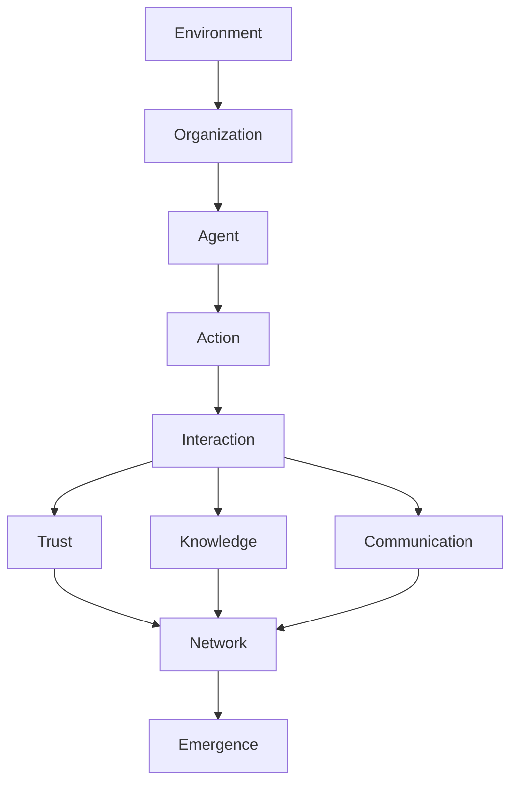

各要素は独立しているのではなく、互いに影響を与えながら時間とともに変化する。

---

# Environment

Environment は組織を取り巻く外部環境を表す。

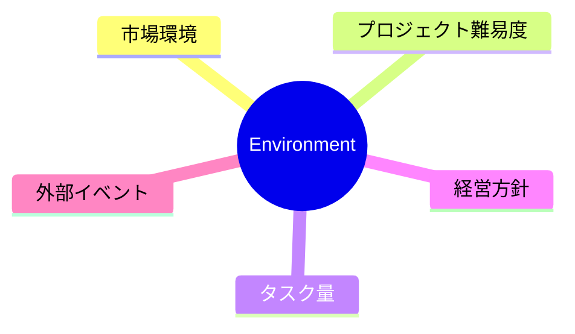

Environment は Agent の意思決定へ影響を与える。

---

# Organization

Organization は Agent 全体を包含するシステムである。

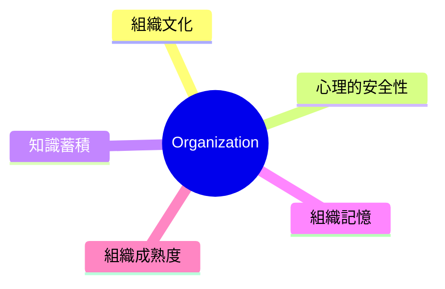

---

# Agent

Agent は組織を構成する最小単位である。

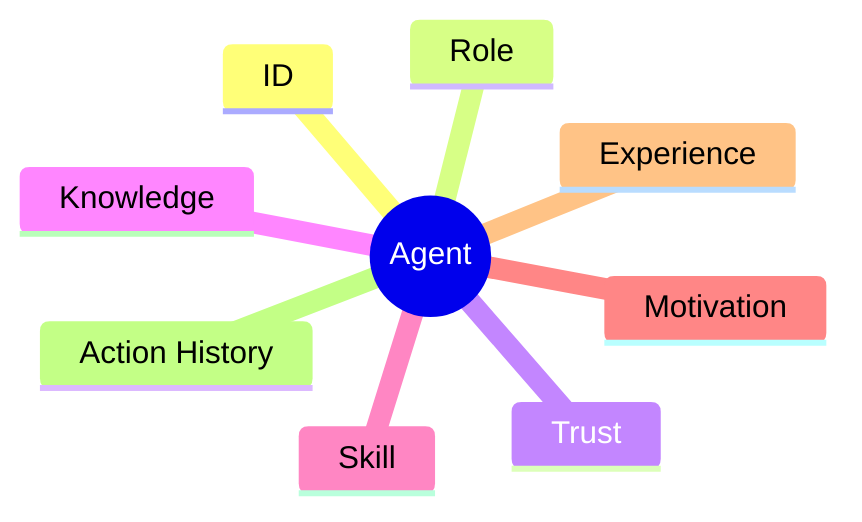

これらの状態はシミュレーション中に変化する。

---

# Action

Agent は各Stepで Action を選択する。

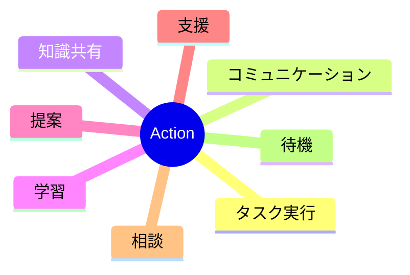

Action は自分自身だけではなく、他 Agent にも影響を与える。

---

# Interaction

Action によって Agent 間の相互作用が発生する。

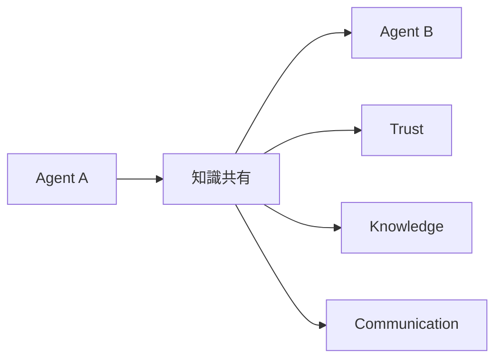

Interaction は Trust・Knowledge・Communication を変化させる基本単位である。

---

# Trust・Knowledge・Communication

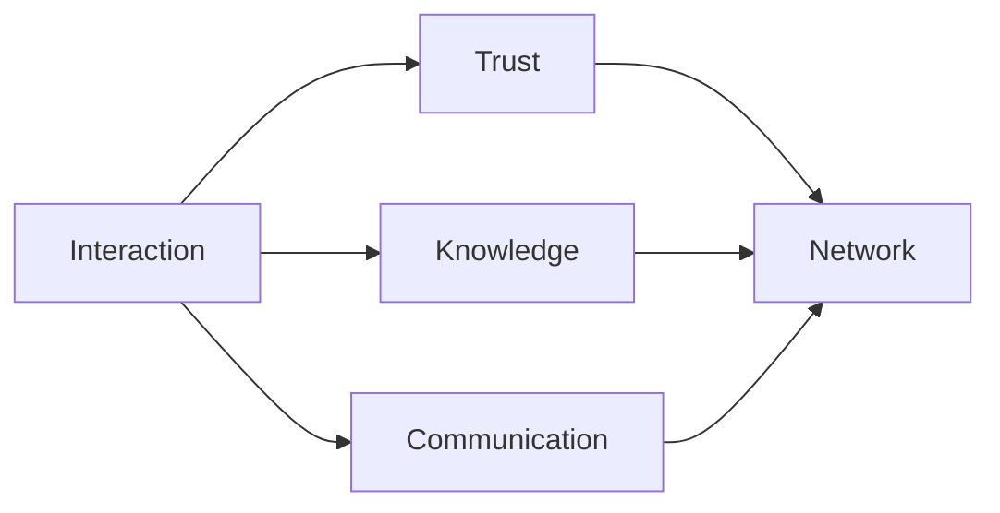

### Trust

- 協力
- 支援
- 約束を守る

などで増加し、

- 裏切り
- 妨害
- 無視

などで減少する。

### Knowledge

学習・経験・情報共有によって変化する。

### Communication

情報交換の頻度や双方向性を表す。

---

# Network

Agent 同士は動的なネットワークを形成する。

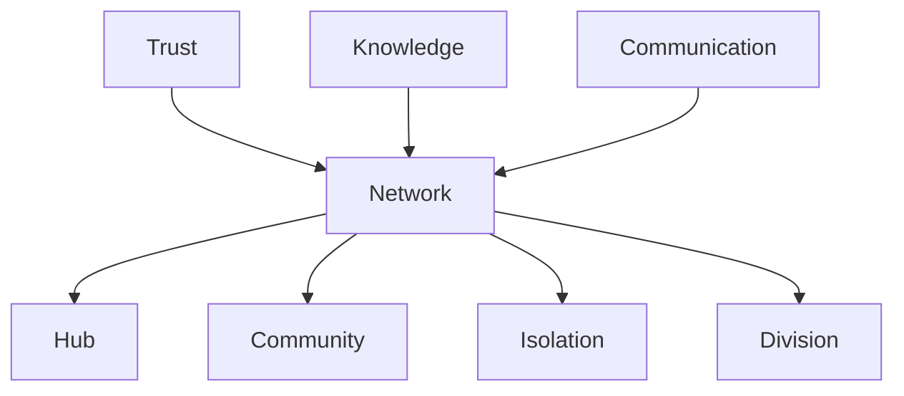

固定ネットワークではなく、シミュレーション中に変化する。

---

# Learning

Learning は Agent の状態を変化させる。

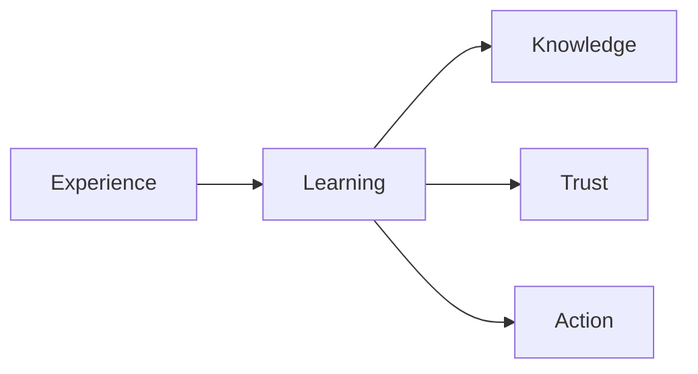

将来的には LLM や強化学習との統合も想定している。

---

# Leadership

Leadership は役職ではなく創発する。

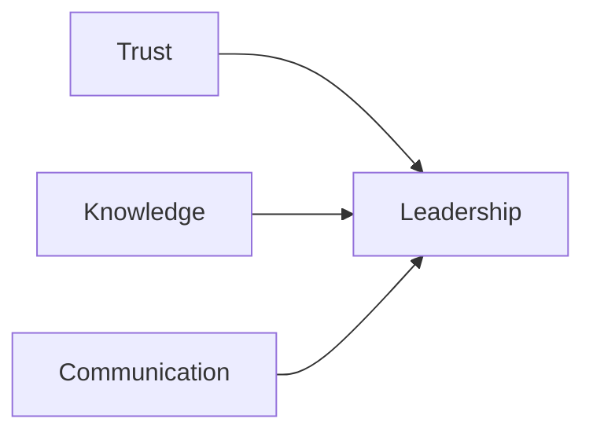

十分な信頼・知識・影響力を持つ Agent が自然にリーダーとなる。

---

# Emergence

組織全体の状態を総合的に評価する。

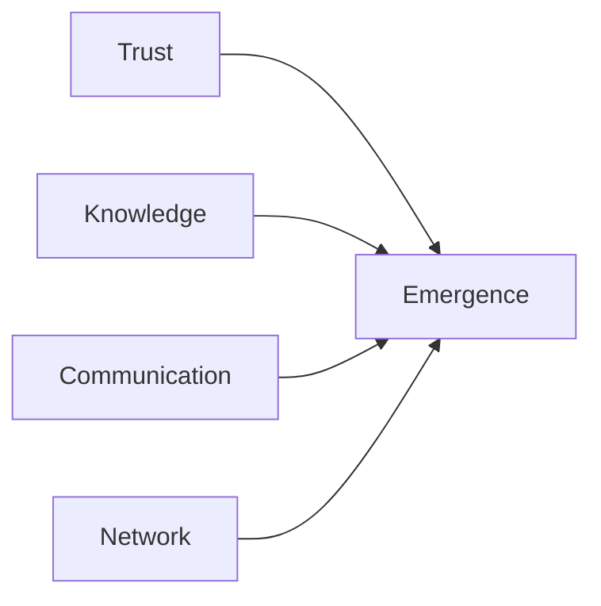

例として、

- 協調性
- 信頼密度
- 知識共有率
- ネットワーク密度
- イノベーション率

などを利用する。

---

# 創発相（Emergence Phase）

組織は時間とともに異なる状態へ遷移する。

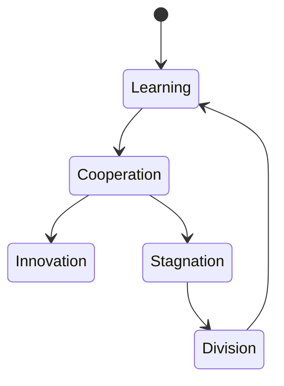

相転移の条件を解析することが本シミュレーションの目的である。

---

# シミュレーションサイクル

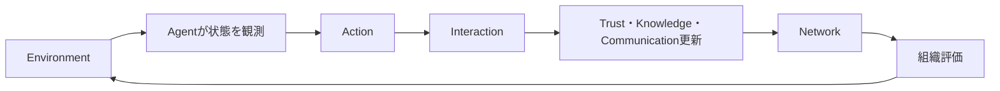

これを1Stepごとに繰り返す。

---

# 評価指標

```mermaid
mindmap
root((Evaluation))

Trust Density

Knowledge Distribution

Communication Density

Network Centrality

Organization Stability

Innovation Index

Emergence Score

Emergence Phase
```

これらを組み合わせて組織全体の状態を評価する。

---

# モデルの進化

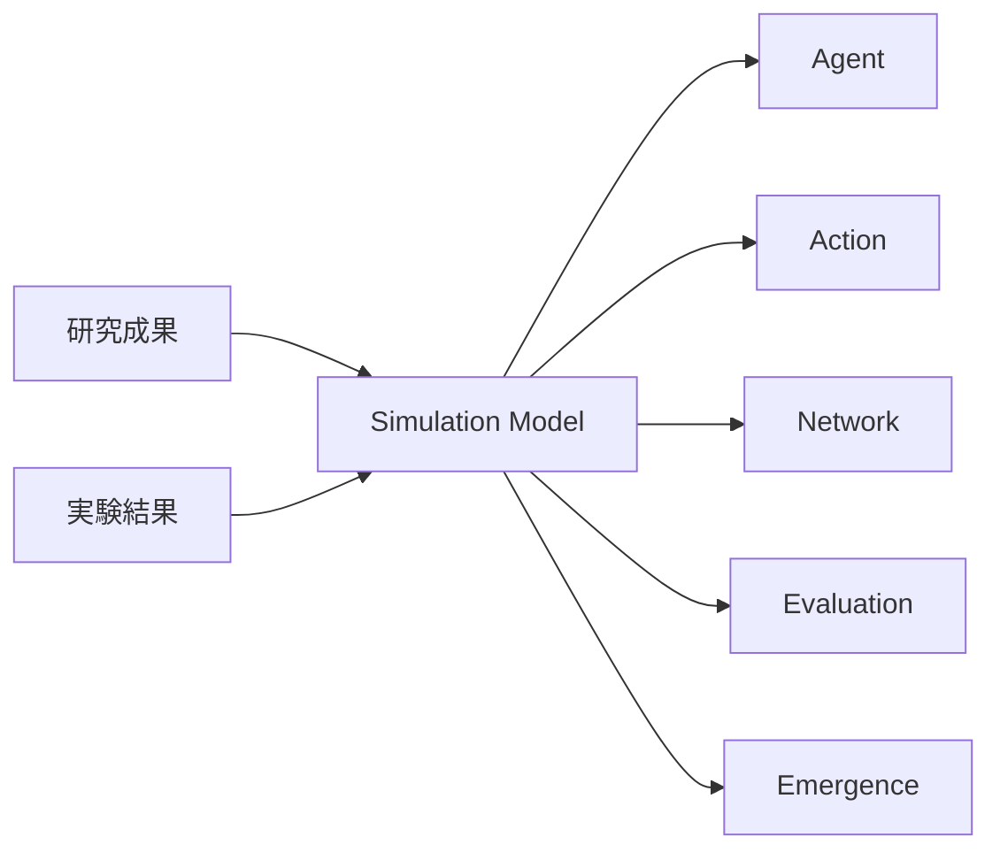

本シミュレーションモデルは固定されたものではない。

新たな研究成果や実験結果を取り込みながら継続的に進化する設計文書として位置付けられる。
