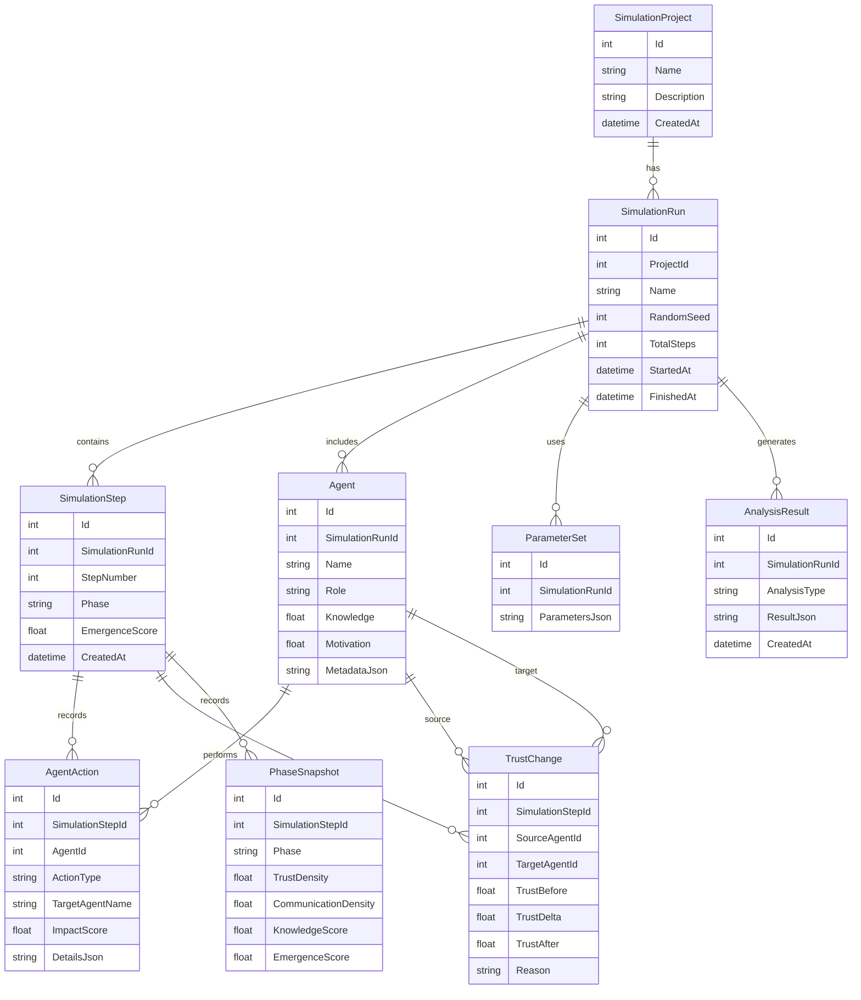
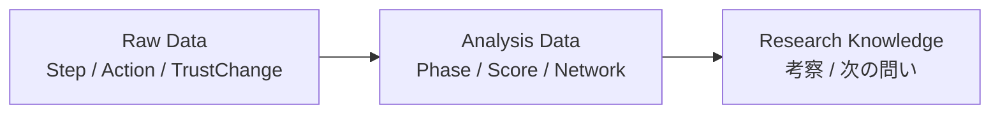

# 05_データベース設計

## 目的

本ドキュメントでは、Emergent Organization Simulator におけるデータベース設計を説明する。

Database は単なるログ保存先ではなく、シミュレーション結果を再現・検証・分析するための研究基盤として位置付ける。

---

## 基本方針

データベース設計では、以下を重視する。

- 再現性
- 観測可能性
- 拡張性
- 実験履歴の追跡
- Agent単位の行動記録
- Trust変化の追跡
- Phase判定の保存

---

## 全体ER図

---

## SimulationProject

SimulationProject は、実験や研究テーマをまとめる単位である。

例として、

- Trustモデル検証
- Knowledge共有実験
- Thanks Coin効果検証
- LLM Agent実験

などを1つのProjectとして扱う。

---

## SimulationRun

SimulationRun は、1回のシミュレーション実行を表す。

保存する主な情報は以下である。

- ProjectId
- 実行名
- 乱数Seed
- 総Step数
- 開始時刻
- 終了時刻
- 実行条件

同じParameterSetとRandomSeedを用いることで、同じ実験を再現できることを目指す。

---

## SimulationStep

SimulationStep は、シミュレーション中の1Stepを表す。

保存する主な情報は以下である。

- StepNumber
- Phase
- EmergenceScore
- Step時点の組織状態

Step単位で記録することで、組織状態がどのように変化したかを時系列で追跡できる。

---

## Agent

Agent は、シミュレーションに参加する主体を表す。

保存する主な情報は以下である。

- Name
- Role
- Knowledge
- Motivation
- MetadataJson

人間、AIエージェント、部署、役割単位などを将来的に同じ構造で扱えるようにする。

---

## AgentAction

AgentAction は、各StepでAgentが行った行動を記録する。

保存する主な情報は以下である。

- AgentId
- ActionType
- TargetAgentName
- ImpactScore
- DetailsJson

これにより、「どのStepで、どのAgentが、どのActionを行ったか」を追跡できる。

---

## TrustChange

TrustChange は、Agent間の信頼変化を記録する。

保存する主な情報は以下である。

- SourceAgentId
- TargetAgentId
- TrustBefore
- TrustDelta
- TrustAfter
- Reason

TrustをSimulationStepに集約して保存するのではなく、Agent間の変化ログとして保存することで、1Step内に複数発生する信頼変化を表現できる。

---

## ParameterSet

ParameterSet は、シミュレーション実行時のパラメータを保存する。

パラメータは変更が多いため、初期段階ではJSONとして保存する。

例として、

- Agent数
- Trust初期値
- Communication確率
- LearningRate
- Action選択確率
- Phase判定閾値

などを含む。

---

## PhaseSnapshot

PhaseSnapshot は、Stepごとの創発相判定結果を保存する。

保存する主な情報は以下である。

- Phase
- TrustDensity
- CommunicationDensity
- KnowledgeScore
- EmergenceScore

創発相の時系列変化を追跡するために使用する。

---

## AnalysisResult

AnalysisResult は、シミュレーション後の解析結果を保存する。

例として、

- Trust Network解析
- Phase Diagram
- Agent行動集計
- Emergence Score推移
- パラメータスイープ結果

などを保存する。

解析内容は増える可能性が高いため、ResultJsonとして柔軟に保持する。

---

## データ保存の考え方

本プロジェクトでは、以下の2種類のデータを分けて考える。

Raw Data は可能な限り細かく保存し、Analysis Data は後から再計算可能な形で保存する。

Research Knowledge は `research/` ディレクトリにMarkdownとして記録する。

---

## JSONを使う理由

初期段階では、すべてを厳密なテーブル構造に分解しすぎない。

理由は以下である。

- モデルがまだ進化中である
- Agent属性が増える可能性が高い
- Parameterの種類が変わる
- AnalysisResultの形式が実験ごとに異なる

そのため、安定した概念はテーブルとして保存し、変化しやすい情報はJSONとして保存する。

---

## 将来的な拡張

将来的には、以下のテーブル追加を検討する。

- KnowledgeTransfer
- CommunicationLog
- OrganizationMemory
- ThanksCoinTransaction
- LlmDecisionLog
- ExperimentBatch
- SweepParameter
- ExternalOrganizationData

特に ThanksCoinTransaction は、相互敬意や貢献可視化の研究において重要なデータになる可能性がある。

---

## まとめ

本データベース設計の目的は、単にシミュレーション結果を保存することではない。

どのStepで、どのAgentが、どのActionを行い、TrustやKnowledgeがどのように変化し、最終的にどの創発相へ到達したのかを追跡可能にすることである。

Database は、創発工学における観測装置であり、AIが生成したシミュレーション結果を人間が検証可能な知識へ変換するための基盤である。
