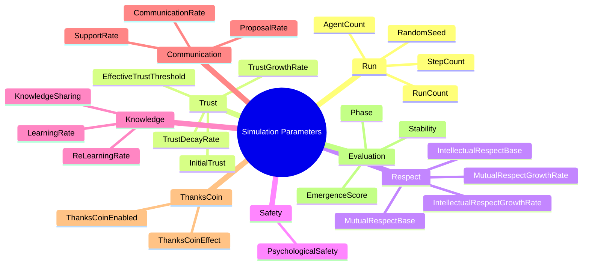
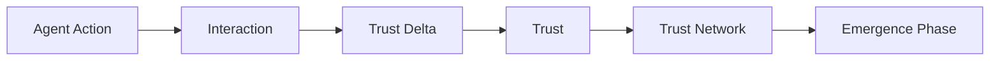
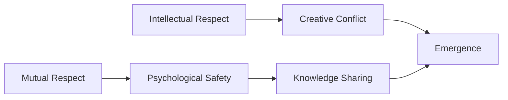
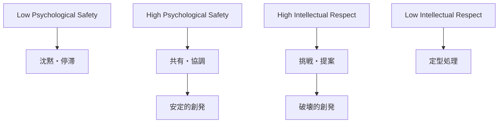
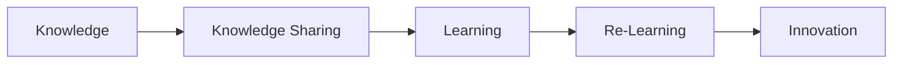
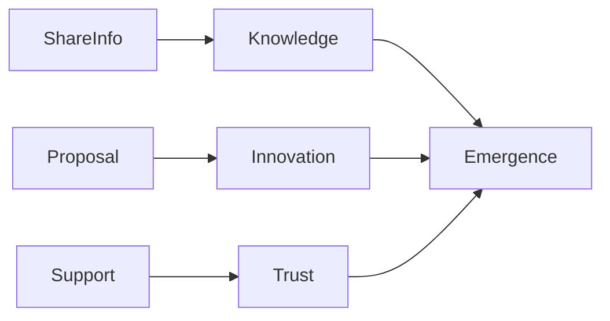
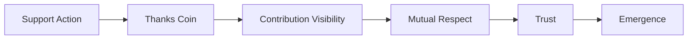
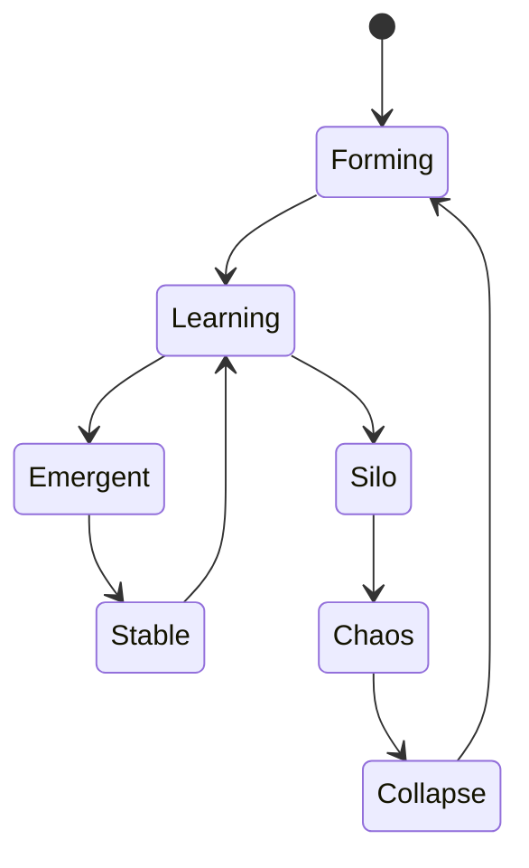
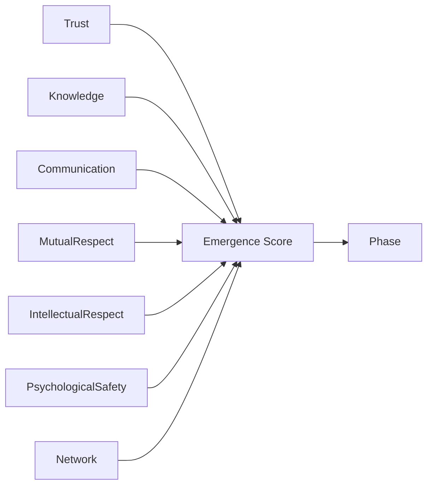
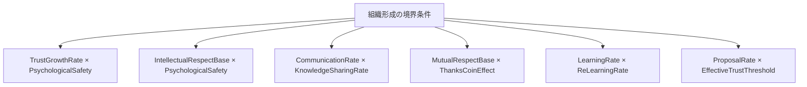

# 06_パラメータ一覧

## 目的

本ドキュメントでは、Emergent Organization Simulator で扱う主要パラメータを整理する。

本プロジェクトにおけるパラメータは、正確な未来予測のための数値ではなく、組織がどのような条件で学習・協調・創発・分断・崩壊へ向かうのかを探索するための実験条件である。

特に本シミュレータでは、組織形成の境界条件として、Trust、Psychological Safety、Mutual Respect、Intellectual Respect、Communication、Knowledge Sharing、Thanks Coin などを重視する。

---

## パラメータ設計の前提

本プロジェクトでは、組織を「管理すれば動く機械」ではなく、「条件が整うことで創発する複雑適応系」として扱う。

そのため、パラメータ設計では次の考え方を重視する。

- 数値の絶対精度よりも、状態変化の方向性を重視する
- 単一の最適値ではなく、相転移が起きる境界条件を探索する
- 管理OSと創造OSを別軸として扱う
- Trustだけでなく、Psychological SafetyやRespectを含めて組織状態を評価する
- AIが示した結果を人間が現実に照らして解釈する

このシミュレータの価値は、厳密な未来予測ではなく、「この条件では何が起こり得るか」を人間が具体的にイメージできるようにする点にある。

---

## パラメータ全体構造

---

## Run Parameters

シミュレーション実行単位を制御する基本パラメータ。

|パラメータ|例|説明|
|---|---:|---|
|AgentCount|10|シミュレーションに参加するAgent数|
|StepCount|50|1回のシミュレーションで実行するStep数|
|RunCount|5|同一条件で繰り返す実行回数|
|RandomSeed|任意|乱数Seed。再現性確保に使用する|

RunCountを複数にすることで、単発の偶然ではなく、条件によって生じやすい傾向を観測する。

---

## Trust Parameters

TrustはAgent間の信頼関係を表す。

組織形成に重要な要素だが、Trust単独で創発が起きるとは限らない。TrustはCommunication、Support、Knowledge Sharing、Respectなどの結果として形成される。

|パラメータ|例|範囲|説明|
|---|---:|---:|---|
|InitialTrust|0.30|0.0 - 1.0|初期信頼値|
|TrustGrowthRate|0.35|0.0 - 1.0|協力・支援・知識共有によるTrust増加率|
|TrustDecayRate|0.03|0.0 - 1.0|時間経過や非協力によるTrust減衰率|
|EffectiveTrustThreshold|0.40|0.0 - 1.0|有効な協力関係として機能し始めるTrust閾値|

Trustは結果指標であると同時に、次のAction選択にも影響する循環的なパラメータである。

---

## Respect Parameters

Respectは、単なる仲の良さではなく、他者の存在や能力を認める組織的な前提条件として扱う。

本プロジェクトでは、Respectを大きく2種類に分ける。

- Mutual Respect
- Intellectual Respect

Mutual Respectは、相互に人として尊重する関係を表す。Intellectual Respectは、知識・専門性・創造性に対する尊重を表す。

|パラメータ|例|範囲|説明|
|---|---:|---:|---|
|MutualRespectBase|0.40|0.0 - 1.0|相互尊重の初期値|
|MutualRespectGrowthRate|0.20|0.0 - 1.0|相互尊重が行動により高まる速度|
|IntellectualRespectBase|0.95|0.0 - 1.0|知的尊重の初期値|
|IntellectualRespectGrowthRate|0.50|0.0 - 1.0|知的尊重が高まる速度|

Intellectual Respectが高く、Psychological Safetyが低い場合、強い創造性と強い摩擦が同時に発生する可能性がある。この条件では、破壊的創発や急速な組織変化が起こりやすい。

---

## Psychological Safety Parameters

Psychological Safetyは、Agentが発言・提案・相談・失敗共有を行いやすいかを表す。

|パラメータ|例|範囲|説明|
|---|---:|---:|---|
|PsychologicalSafety|0.30|0.0 - 1.0|心理的安全性の初期値または環境値|

Psychological Safetyが高い場合、相談・支援・知識共有が起きやすい。一方で、低い場合でもIntellectual Respectが高いと、強い提案や衝突を伴う創発が起こる可能性がある。

---

## Knowledge Parameters

KnowledgeはAgentが持つ知識、経験、専門性を表す。

組織創発では、単に知識量が多いだけでは不十分であり、Knowledgeが共有され、再構成され、再学習されることが重要である。

|パラメータ|例|範囲|説明|
|---|---:|---:|---|
|InitialKnowledge|任意|0.0 - 1.0|Agentの初期知識量|
|KnowledgeSharingRate|任意|0.0 - 1.0|知識共有の起こりやすさ|
|LearningRate|任意|0.0 - 1.0|新しい知識を獲得する速度|
|ReLearningRate|任意|0.0 - 1.0|既存知識を更新・再構成する速度|

境界条件の議論では、創発には単なる学習だけでなく、再学習やセレンディピティが必要であると考える。

---

## Communication Parameters

CommunicationはAgent間の情報交換を表す。

現在の実装では、ShareInfo、Proposal、Support などのActionを通じてCommunicationが発生する。

|パラメータ|例|範囲|説明|
|---|---:|---:|---|
|CommunicationRate|任意|0.0 - 1.0|Communication発生率|
|ShareInfoRate|任意|0.0 - 1.0|情報共有Actionの発生率|
|ProposalRate|任意|0.0 - 1.0|提案Actionの発生率|
|SupportRate|任意|0.0 - 1.0|支援Actionの発生率|

CommunicationはTrust形成の原因であり、Knowledge共有の経路でもある。TrustよりもCommunicationが支配的に見えるケースでは、TrustはCommunicationの結果として形成されている可能性がある。

---

## Thanks Coin Parameters

Thanks Coinは、相互敬意や貢献を可視化するための仕組みである。

これは報酬制度というより、組織内の見えにくい支援・貢献・感謝をネットワークとして観測するためのパラメータである。

|パラメータ|例|範囲|説明|
|---|---:|---:|---|
|ThanksCoinEnabled|false|true / false|Thanks Coin機能を使うか|
|ThanksCoinEffect|0.10|0.0 - 1.0|Thanks CoinがTrustやRespectに与える影響|
|ThanksCoinVisibility|任意|0.0 - 1.0|貢献可視化の強さ|
|ThanksCoinDecay|任意|0.0 - 1.0|過去の貢献記録の減衰率|

Thanks Coinは、指示や評価では拾いにくい相互貢献を可視化し、知らず知らずのうちに組織を良くしていく仕組みとして扱う。

---

## Phase Parameters

Phaseは組織状態を表す。

現在想定している主なPhaseは以下である。

|Phase|説明|
|---|---|
|Forming|組織形成初期|
|Learning|学習が進んでいる状態|
|Emergent|創発が起きている状態|
|Stable|安定して機能している状態|
|Silo|部分最適・縦割りが強い状態|
|Chaos|秩序が不安定な状態|
|Collapse|組織機能が崩壊している状態|

Phase判定は単一指標ではなく、Trust、Communication、Knowledge、Respect、Psychological Safetyなどを組み合わせて行う。

---

## Evaluation Parameters

Evaluation Parametersは、組織状態の評価に使う重みである。

|パラメータ|説明|
|---|---|
|TrustWeight|TrustをEmergenceScoreへ反映する重み|
|KnowledgeWeight|KnowledgeをEmergenceScoreへ反映する重み|
|CommunicationWeight|CommunicationをEmergenceScoreへ反映する重み|
|MutualRespectWeight|Mutual Respectを評価へ反映する重み|
|IntellectualRespectWeight|Intellectual Respectを評価へ反映する重み|
|PsychologicalSafetyWeight|Psychological Safetyを評価へ反映する重み|
|NetworkWeight|Network構造を評価へ反映する重み|

---

## 境界条件として重視する組み合わせ

本プロジェクトでは、単独パラメータではなく、複数パラメータの組み合わせを重視する。

特に重要な組み合わせは以下である。

|組み合わせ|観測したい境界条件|
|---|---|
|TrustGrowthRate × PsychologicalSafety|安定的な協調が生まれる条件|
|IntellectualRespectBase × PsychologicalSafety|破壊的創発と停滞の境界|
|CommunicationRate × KnowledgeSharingRate|学習相から創発相への遷移条件|
|MutualRespectBase × ThanksCoinEffect|相互敬意が可視化によって高まる条件|
|LearningRate × ReLearningRate|単なる学習と知識再構成の違い|
|ProposalRate × EffectiveTrustThreshold|提案が受け入れられる条件|

---

## 実験プリセット例

### 安定協調型

|パラメータ|値|
|---|---:|
|AgentCount|10|
|StepCount|50|
|RunCount|5|
|InitialTrust|0.40|
|TrustGrowthRate|0.25|
|TrustDecayRate|0.02|
|EffectiveTrustThreshold|0.35|
|MutualRespectBase|0.60|
|PsychologicalSafety|0.70|
|IntellectualRespectBase|0.60|
|ThanksCoinEffect|0.10|

### 破壊的創発型

|パラメータ|値|
|---|---:|
|AgentCount|10|
|StepCount|50|
|RunCount|5|
|InitialTrust|0.30|
|TrustGrowthRate|0.35|
|TrustDecayRate|0.03|
|EffectiveTrustThreshold|0.40|
|MutualRespectBase|0.40|
|MutualRespectGrowthRate|0.20|
|PsychologicalSafety|0.30|
|IntellectualRespectBase|0.95|
|IntellectualRespectGrowthRate|0.50|
|ThanksCoinEffect|0.00 - 0.10|

破壊的創発型は、Intellectual Respectが非常に高く、Psychological Safetyが低い条件で、強い提案・摩擦・再構成が発生するかを観測するためのプリセットである。

---

## パラメータ設計方針

本プロジェクトでは、パラメータを固定値ではなく、組織創発を理解するための実験条件として扱う。

重要なのは、最適な単一値を求めることではない。どの条件で組織が学習し、どの条件で創発し、どの条件で分断・崩壊するかを明らかにすることである。

そのため、各パラメータは単独で評価するのではなく、Phase Diagramやパラメータスイープを通じて境界条件として解析する。

---

## まとめ

パラメータは、組織を操作するための設定値ではなく、組織創発を観測するための実験条件である。

Trust、Communication、Knowledge、Respect、Psychological Safety、Thanks Coin などの組み合わせによって、組織は Forming、Learning、Emergent、Stable、Silo、Chaos、Collapse といった異なるPhaseへ遷移する。

本プロジェクトでは、この相転移の境界条件を探索し、AIが示す大量の結果を人間が理解可能な知識へ翻訳することを目指す。
