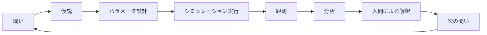
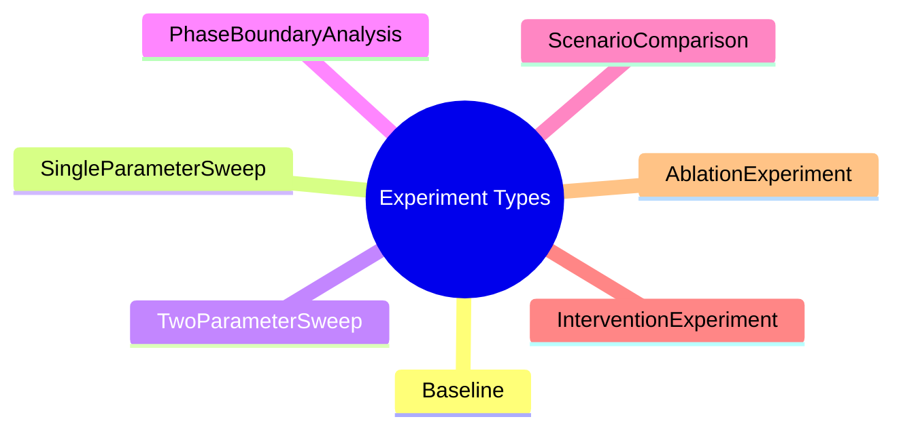
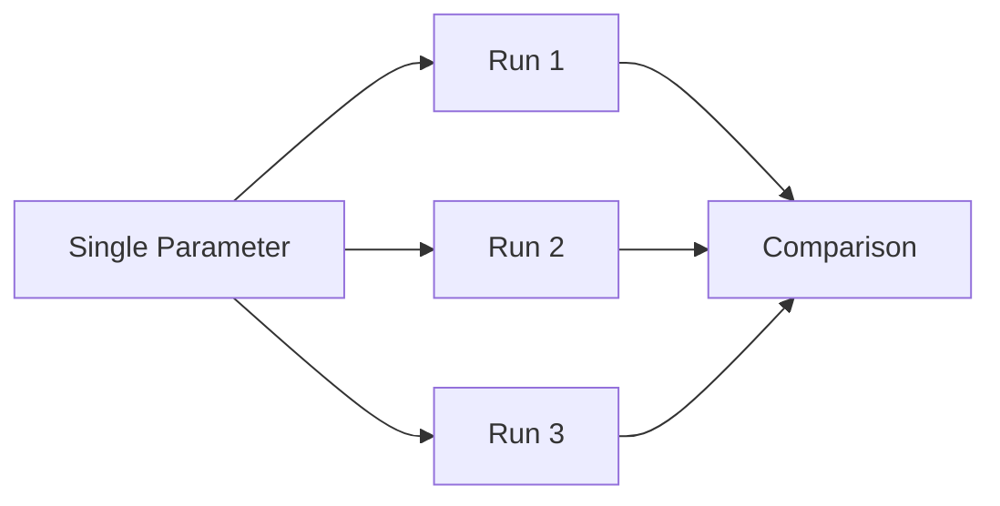
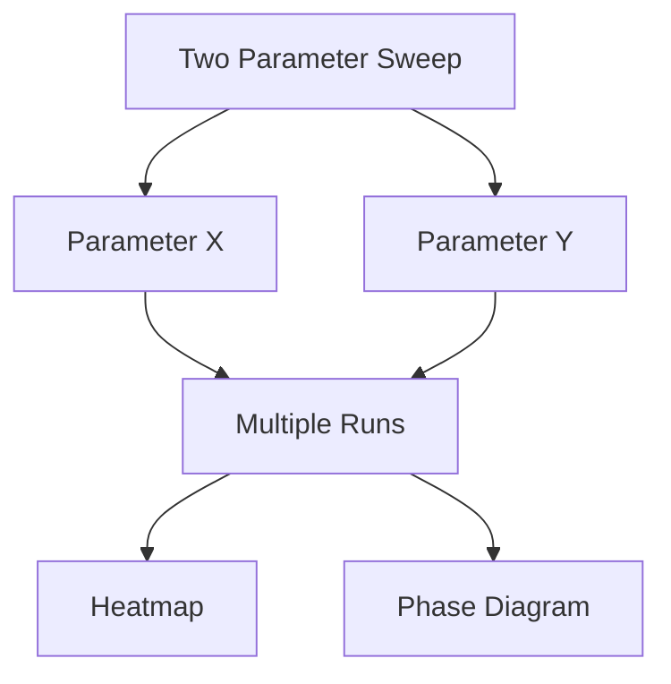
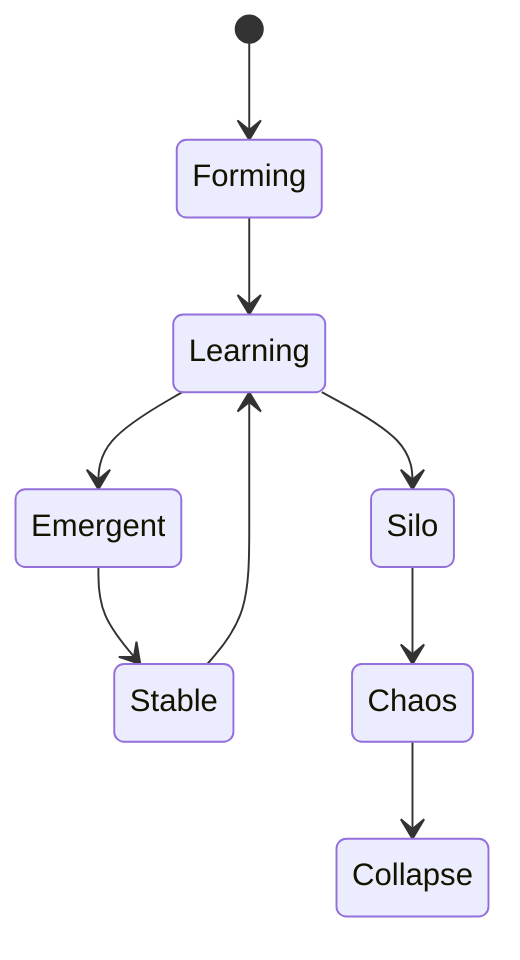
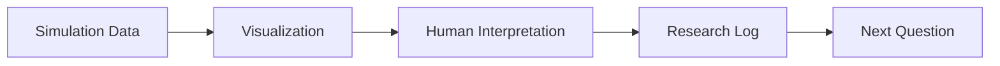

# 07_実験方法

## 目的

本ドキュメントでは、Emergent Organization Simulator を用いた実験方法を定義する。

本プロジェクトにおける実験は、現実の未来を正確に予測することではなく、組織がどのような条件で Forming、Learning、Emergent、Stable、Silo、Chaos、Collapse といったPhaseへ遷移するのかを観測するために行う。

特に、Trust、Communication、Knowledge、Respect、Psychological Safety、Thanks Coin などの組み合わせが、組織形成の境界条件にどのような影響を与えるかを検証する。

---

## 実験の基本思想

本シミュレータは、厳密な数値予測を目的とするものではない。

重要なのは、パラメータを変化させたときに、どのような組織状態が現れやすいのかを観測し、人間が現実の組織に照らして具体的に解釈できることである。

実験では、以下の考え方を重視する。

- 単発の結果ではなく、複数回実行による傾向を見る
- 単一パラメータではなく、パラメータの組み合わせを見る
- 数値そのものより、Phaseの遷移と境界条件を見る
- AIが出した結果を人間が現実に照らして解釈する
- 実験結果から次の問いを生成する

---

## 実験サイクル

実験は次のサイクルで行う。



このサイクルを繰り返すことで、創発工学の知見を蓄積する。

---

## 標準実験プロトコル

各実験では、以下の手順を基本とする。

### 1. 問いを定義する

最初に、何を明らかにしたいのかを明確にする。

例：

- Trustは組織創発にどの程度影響するのか
- Psychological Safetyが低くても創発は起きるのか
- Intellectual Respectが高い場合、破壊的創発は起きるのか
- Thanks Coinは相互敬意の形成に寄与するのか
- CommunicationはTrustの原因なのか結果なのか

### 2. 仮説を立てる

問いに対して、事前に予想される結果を書く。

例：

- CommunicationRateが高いほどLearning相へ入りやすい
- IntellectualRespectBaseが高くPsychologicalSafetyが低い場合、ChaosまたはEmergentへ遷移しやすい
- ThanksCoinEffectが一定以上あると、MutualRespectが高まりStableへ移行しやすい

### 3. パラメータを設定する

検証したいパラメータと固定するパラメータを分ける。

例：

|区分|パラメータ|扱い|
|---|---|---|
|変更する|PsychologicalSafety|0.1刻みで変更|
|変更する|IntellectualRespectBase|0.1刻みで変更|
|固定する|AgentCount|10|
|固定する|StepCount|50|
|固定する|RunCount|5|

### 4. シミュレーションを実行する

同じ条件で複数回実行し、乱数による偶然をならす。

最低限、以下を記録する。

- ParameterSet
- RandomSeed
- RunCount
- StepCount
- 最終Phase
- Phase遷移履歴
- EmergenceScore
- AgentAction
- TrustChange

### 5. 結果を観測する

数値だけでなく、Phaseの遷移を見る。

例：

- FormingからLearningへ移行したか
- LearningからEmergentへ移行したか
- SiloやChaosへ落ちたか
- Collapseが発生したか
- Stableへ収束したか

### 6. 可視化する

実験結果は、可能な限り可視化する。

主な可視化対象は以下である。

- Phase Timeline
- Emergence Score
- Trust Network
- Communication Network
- Knowledge Distribution
- Parameter Heatmap
- Phase Diagram

### 7. 解釈する

最後に、人間が結果を解釈する。

ここでは、AIやシミュレータが出した結果をそのまま正解としない。

現実の組織に照らして、

- 具体的にイメージできるか
- 現実の経験と矛盾しないか
- どのような施策に置き換えられるか
- 逆に何が見落とされているか

を考察する。

### 8. 次の問いを作る

実験は結果を出して終わりではない。

実験結果から、次に検証すべき問いを定義する。

例：

- TrustよりCommunicationの影響が大きいなら、Trustは結果指標なのか
- Intellectual Respectが高いとChaosが増えるなら、何がEmergentとの差を作るのか
- Thanks Coinが効く条件と効かない条件は何か

---

## 実験の種類

本プロジェクトでは、主に以下の実験を行う。



---

## Baseline Experiment

Baseline Experiment は、基準となるパラメータでシミュレーションを行う実験である。

目的は、標準条件における組織の自然な振る舞いを確認することである。

例：

|パラメータ|値|
|---|---:|
|AgentCount|10|
|StepCount|50|
|RunCount|5|
|InitialTrust|0.30|
|TrustGrowthRate|0.35|
|TrustDecayRate|0.03|
|EffectiveTrustThreshold|0.40|
|MutualRespectBase|0.40|
|PsychologicalSafety|0.30|
|IntellectualRespectBase|0.95|

Baseline は、以後の実験結果と比較する基準として利用する。

---

## Single Parameter Sweep

Single Parameter Sweep は、1つのパラメータだけを変化させる実験である。

目的は、そのパラメータが組織状態に与える単独の影響を確認することである。

例：

|変更パラメータ|範囲|
|---|---|
|InitialTrust|0.0 - 1.0|
|PsychologicalSafety|0.0 - 1.0|
|CommunicationRate|0.0 - 1.0|
|ThanksCoinEffect|0.0 - 1.0|



---

## Two Parameter Sweep

Two Parameter Sweep は、2つのパラメータを同時に変化させる実験である。

目的は、相転移が起こる境界条件を確認することである。

特に重要な組み合わせは以下である。

|組み合わせ|目的|
|---|---|
|TrustGrowthRate × PsychologicalSafety|安定協調が生まれる条件を見る|
|IntellectualRespectBase × PsychologicalSafety|破壊的創発と停滞の境界を見る|
|CommunicationRate × KnowledgeSharingRate|LearningからEmergentへの遷移を見る|
|MutualRespectBase × ThanksCoinEffect|貢献可視化によるRespect形成を見る|
|LearningRate × ReLearningRate|学習と再学習の違いを見る|
|ProposalRate × EffectiveTrustThreshold|提案が受け入れられる条件を見る|



---

## Phase Boundary Analysis

Phase Boundary Analysis は、組織状態が別のPhaseへ切り替わる境界を調べる実験である。

本プロジェクトでは、次のような遷移を重視する。

|遷移|意味|
|---|---|
|Forming → Learning|組織が学習を開始する|
|Learning → Emergent|知識や相互作用から創発が起きる|
|Emergent → Stable|創発が安定化する|
|Learning → Silo|学習が部分最適へ閉じる|
|Silo → Chaos|分断が不安定化する|
|Chaos → Collapse|組織機能が崩壊する|



Phaseの境界を調べることで、「どの条件を超えると組織状態が変わるのか」を観測する。

---

## Scenario Comparison

Scenario Comparison は、現実の組織状況を想定した複数のシナリオを比較する実験である。

例：

|シナリオ|特徴|
|---|---|
|安定協調型|PsychologicalSafetyとMutualRespectが高い|
|破壊的創発型|IntellectualRespectが高くPsychologicalSafetyが低い|
|縦割り型|CommunicationRateが低くSiloへ向かいやすい|
|管理OS型|Trustよりルールと統制が強い|
|創造OS型|Proposal、Learning、ReLearningが強い|
|Thanks Coin導入型|貢献可視化によりRespectが高まる|

Scenario Comparison は、単一パラメータではなく、複数条件の組み合わせによる組織状態の違いを見るために使う。

---

## Intervention Experiment

Intervention Experiment は、シミュレーション途中で介入を行う実験である。

目的は、組織状態が悪化したときに、どの施策がPhase遷移を変えられるかを見ることである。

例：

|介入|想定効果|
|---|---|
|Thanks Coin導入|SupportやMutualRespectを可視化する|
|Communication促進|Silo化を防ぐ|
|Knowledge Sharing強化|LearningからEmergentへ移行しやすくする|
|Psychological Safety改善|相談や提案を増やす|
|ReLearning促進|停滞した知識を再構成する|


---

## Ablation Experiment

Ablation Experiment は、特定の要素を取り除いて影響を確認する実験である。

目的は、創発に必要な要素を見極めることである。

例：

|除外する要素|確認したいこと|
|---|---|
|Trust更新なし|Trustが本当に必要か|
|Knowledge Sharingなし|学習相が成立するか|
|Supportなし|相互敬意が形成されるか|
|Proposalなし|創発やInnovationが起きるか|
|Thanks Coinなし|貢献可視化の効果があるか|

Ablationにより、「その要素がないと何が失われるのか」を観測する。

---

## 観測項目

各実験で観測する主な項目は以下である。

|観測項目|説明|
|---|---|
|FinalPhase|最終的に到達したPhase|
|PhaseTransition|Phaseの遷移履歴|
|EmergenceScore|創発度|
|TrustDensity|Trustネットワークの密度|
|CommunicationDensity|Communicationの密度|
|KnowledgeScore|知識量または知識共有度|
|MutualRespect|相互尊重の状態|
|IntellectualRespect|知的尊重の状態|
|PsychologicalSafety|心理的安全性|
|AgentActionCount|Action種別ごとの回数|
|TrustChangeLog|Trust変化の履歴|
|ThanksCoinFlow|Thanks Coinの流れ|

---

## 結果の読み方

実験結果は、単純に「成功」「失敗」で判断しない。

重要なのは、どの条件でどのPhaseに入りやすいかを理解することである。

例：

- Emergentが多い条件は、創発しやすい条件である
- Stableが多い条件は、安定運用に向いている可能性がある
- Siloが多い条件は、部分最適化しやすい
- Chaosが多い条件は、創造的摩擦と崩壊の境界にある
- Collapseが多い条件は、組織維持に必要な条件が不足している

---

## 実験結果の記録

実験結果は `research/` ディレクトリにMarkdownとして記録する。

ファイル名は日付を基本とする。

```text
research/
  2026-07-10.md
  2026-07-11.md
  2026-07-12.md
```

研究ノートには、最低限以下を記録する。

```markdown
# yyyy-mm-dd 実験タイトル

## 問い

## 仮説

## 実験条件

## 実行結果

## 観測されたPhase

## 考察

## 現実組織への解釈

## 次の問い
```

---

## 研究ノートの位置付け

研究ノートは、単なる作業ログではない。

AIが出した結果を人間が理解し、次の問いへ変換するための知識翻訳の場である。



---

## 再現性のための記録

各実験では、再現性のために以下を保存する。

|項目|説明|
|---|---|
|ParameterSet|使用した全パラメータ|
|RandomSeed|乱数Seed|
|SimulatorVersion|実行時のバージョン|
|GitCommitHash|実行時のコミット|
|RunCount|繰り返し回数|
|StepCount|Step数|
|ResultFile|結果データ|
|ResearchNote|考察Markdown|

再現できない実験は、創発工学の知識として扱いにくい。

そのため、結果だけでなく条件も必ず保存する。

---

## まとめ

実験方法の目的は、組織創発を数値だけで評価することではない。

パラメータを変更し、Phaseの遷移を観測し、AIが生成した大量の結果を人間が解釈することで、組織形成の境界条件を明らかにすることである。

Emergent Organization Simulator における実験は、「問い → 仮説 → 実行 → 観測 → 解釈 → 次の問い」という循環によって進む。

この循環そのものが、創発工学における研究方法である。
