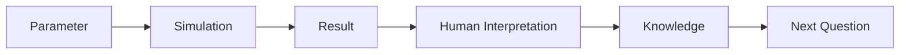
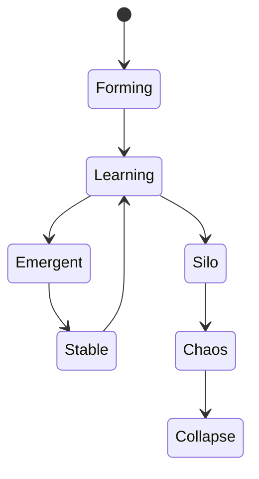
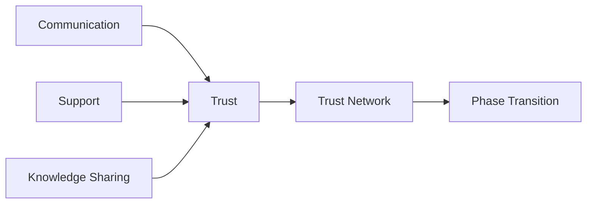
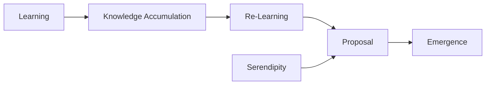
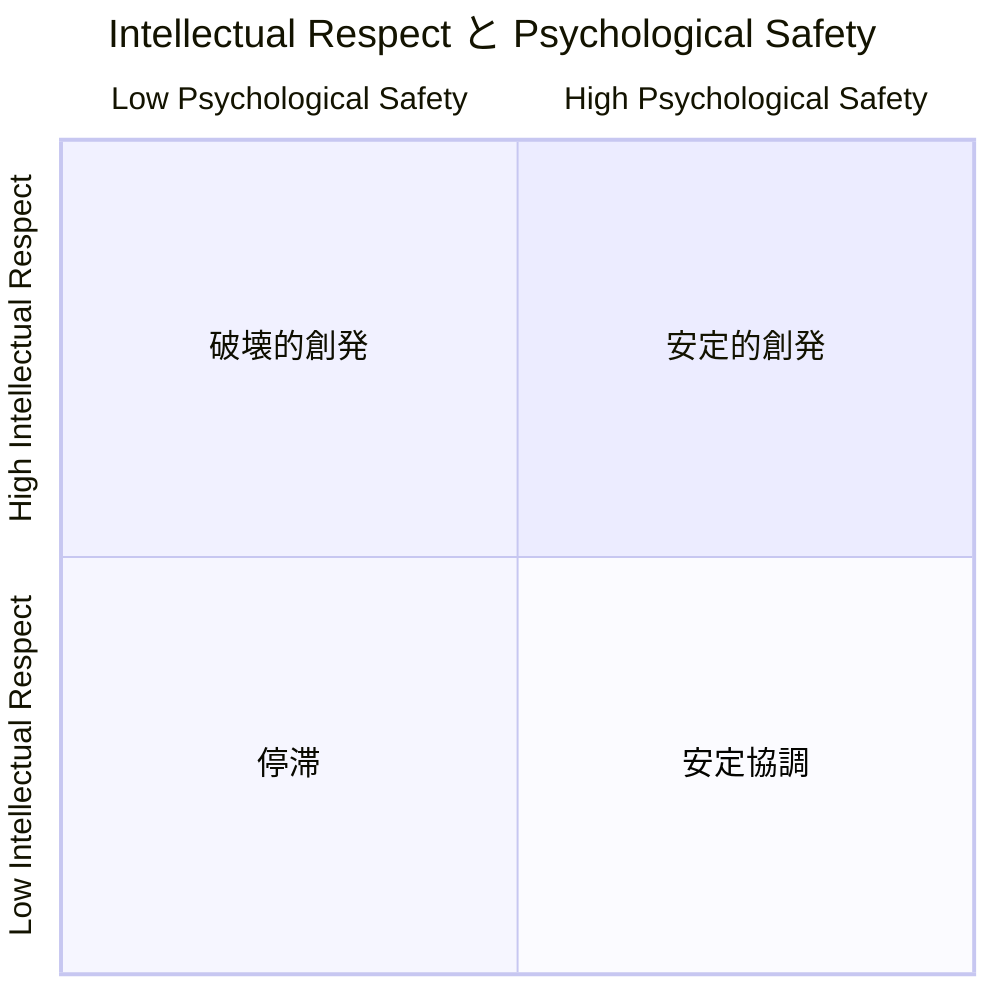
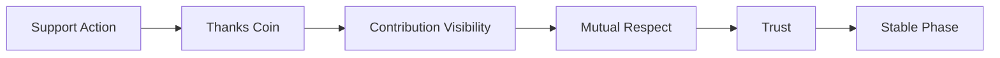
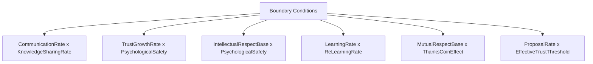

# 08_実験結果

## 目的

本ドキュメントでは、Emergent Organization Simulator によって得られた実験結果を整理する。

ここで扱う結果は、現実組織の未来を正確に予測するものではない。目的は、パラメータを変化させたときに組織状態がどのように遷移するかを観測し、創発工学における境界条件を見つけることである。

---

## 結果の位置付け

本プロジェクトにおける実験結果は、確定的な結論ではなく、次の問いを生み出すための観測記録である。

AIやシミュレータが出した結果をそのまま正解とせず、人間が現実の組織に照らして解釈することを重視する。

---

## 現時点での結果サマリー

現時点の初期検証では、以下の傾向が観測されている。

|観測項目|暫定結果|
|---|---|
|Trust|重要だが、単独では創発を十分に説明できない|
|Communication|Learning相への遷移に強く影響する|
|Knowledge Sharing|Emergent相への移行に必要な要素|
|Re-Learning|単なる知識蓄積ではなく、知識の再構成に重要|
|Serendipity|予定された学習だけでは届かない創発に関与する可能性|
|Mutual Respect|組織の安定性と協力関係に影響する|
|Intellectual Respect|強い提案・創造的衝突・破壊的創発に関与する可能性|
|Psychological Safety|安定的な共有・相談・支援を促進する|
|Thanks Coin|相互貢献や敬意の可視化手段として有効性を検証中|

---

## 観測されたPhase

本プロジェクトでは、組織状態をPhaseとして扱う。

|Phase|状態|
|---|---|
|Forming|組織形成初期|
|Learning|学習・情報共有が進み始めた状態|
|Emergent|相互作用から新しい構造や行動が生まれる状態|
|Stable|創発した構造が安定して機能している状態|
|Silo|部分最適化・縦割りが進んだ状態|
|Chaos|相互作用はあるが秩序が不安定な状態|
|Collapse|組織機能が崩壊した状態|

現時点では、FormingからLearningへの遷移にはCommunicationが重要であり、LearningからEmergentへの遷移にはKnowledge Sharing、Re-Learning、Serendipityが関与する可能性が高い。

---

## 初期観測1: Trust単独では創発しない

Trustは組織形成に重要な要素である。しかし、初期検証ではTrustが高いだけでは必ずしもEmergent相へ移行しないことが示唆されている。

Trustは原因であると同時に、CommunicationやSupportの結果として形成される側面を持つ。そのため、Trustを単独の入力パラメータとして扱うよりも、相互作用の履歴から形成される動的な状態として扱う必要がある。

### 解釈

現実の組織でも、「信頼が大事」と言うだけでは組織は変わらない。信頼は、日々の情報共有、支援、約束の履行、貢献の可視化によって形成される。したがって、Trustは単独施策ではなく、行動ログと結び付けて観測する必要がある。

---

## 初期観測2: CommunicationはLearning相への入口になる

Communicationが一定以上ある条件では、FormingからLearningへ遷移しやすくなる傾向がある。

Communicationは単なる会話量ではなく、情報共有、相談、支援、提案を含む相互作用の密度として扱う。

|Communication状態|観測されやすいPhase|
|---|---|
|低い|Forming / Silo|
|中程度|Learning|
|高い|Learning / Emergent / Chaos|

Communicationが低い場合、Agent間の相互作用が不足し、学習が組織全体へ広がらない。一方で、Communicationが高すぎる場合でも、RespectやPsychological Safetyが不足しているとChaosへ向かう可能性がある。

---

## 初期観測3: LearningだけではEmergentに届かない

Learning相では知識共有や経験蓄積が進む。しかし、単なる学習だけではEmergent相へ到達しない場合がある。

Emergent相へ移行するには、以下の要素が必要である可能性がある。

- Knowledge Sharing
- Re-Learning
- Serendipity
- Proposal
- Intellectual Respect
- Network再構成

### 解釈

組織が学習していても、新しい価値が生まれるとは限らない。既存知識を蓄積するだけではなく、知識を組み替える再学習と、偶発的な接続を受け入れる余地が必要になる。

---

## 初期観測4: Intellectual Respectは創造的衝突を生む

Intellectual Respectが高い条件では、Agentが他者の知識や専門性を認めるため、提案や議論が発生しやすくなる。

一方で、Psychological Safetyが低い場合、強い提案や知的衝突がChaosへ向かう可能性もある。

|Intellectual Respect|Psychological Safety|想定される状態|
|---:|---:|---|
|低い|低い|沈黙・停滞|
|低い|高い|安定するが創造性は弱い|
|高い|高い|安定的創発|
|高い|低い|破壊的創発またはChaos|

### 解釈

創造性の高い組織では、心理的安全性だけでなく知的尊重が重要になる。心理的安全性が高くても、知的尊重が低ければ鋭い提案は生まれにくい。一方で、知的尊重が高く心理的安全性が低い場合、強い摩擦を伴う創発が発生する可能性がある。

---

## 初期観測5: Thanks Coinは相互貢献の可視化に使える

Thanks Coinは、評価制度ではなく、支援・貢献・感謝を可視化するための仕組みとして扱う。

現時点では実装・検証中の要素であるが、以下の効果を期待している。

- Support行動の可視化
- Mutual Respectの形成
- Trust形成の補助
- 孤立Agentの発見
- 貢献ネットワークの可視化

### 解釈

現実の組織では、支援や翻訳、調整、助言といった行動は評価されにくい。Thanks Coinは、そうした見えにくい貢献をネットワークとして可視化し、組織が知らず知らずのうちに良くなる条件を作る可能性がある。

---

## Phase別の特徴

実験結果を整理する際は、最終Phaseだけでなく、Phaseごとの特徴を見る。

|Phase|主な特徴|観測すべき指標|
|---|---|---|
|Forming|相互作用が少ない|Action数、CommunicationRate|
|Learning|知識共有が増える|KnowledgeScore、ShareInfo数|
|Emergent|提案・再構成が起きる|Proposal数、EmergenceScore|
|Stable|協力関係が安定する|TrustDensity、MutualRespect|
|Silo|部分最適化する|Network分断、Communication偏り|
|Chaos|相互作用は多いが不安定|Trust変動、Phase揺らぎ|
|Collapse|組織機能が失われる|Action低下、Trust低下|

---

## 境界条件の整理

現時点で重要と考えている境界条件は以下である。

|境界条件|観測したいこと|
|---|---|
|CommunicationRate × KnowledgeSharingRate|LearningからEmergentへ移行する条件|
|TrustGrowthRate × PsychologicalSafety|安定協調が生まれる条件|
|IntellectualRespectBase × PsychologicalSafety|破壊的創発と停滞の境界|
|LearningRate × ReLearningRate|単なる学習と知識再構成の違い|
|MutualRespectBase × ThanksCoinEffect|可視化が相互敬意へ与える影響|
|ProposalRate × EffectiveTrustThreshold|提案が受け入れられる条件|

---

## 結果の読み方

本プロジェクトでは、実験結果を単純な成功・失敗として扱わない。

重要なのは、どの条件でどのPhaseに入りやすいかを理解することである。

例えば、Emergentが増えた条件は創発しやすい条件であり、Stableが増えた条件は安定運用に向く可能性がある。Siloが増えた条件は部分最適化しやすく、Chaosが増えた条件は創造的摩擦と崩壊の境界にあると解釈できる。

---

## 現時点の暫定結論

現時点では、以下を暫定的な結論とする。

- Trustは重要だが、単独では創発を説明できない
- CommunicationはLearning相への遷移に強く関与する
- Emergent相にはKnowledge SharingだけでなくRe-Learningが必要になる可能性がある
- Serendipityは予定された学習を超えた創発に関与する可能性がある
- Intellectual Respectは創造的提案を生むが、Psychological Safetyが低いとChaosへ向かう可能性がある
- Thanks Coinは相互貢献とRespectを可視化する手段として有望である

---

## 今後の実験課題

今後は以下の実験を優先する。

|優先度|実験|目的|
|---|---|---|
|高|CommunicationRate × KnowledgeSharingRate|LearningからEmergentへの境界を見る|
|高|IntellectualRespectBase × PsychologicalSafety|破壊的創発とChaosの境界を見る|
|高|ThanksCoinEffect × MutualRespectBase|貢献可視化の効果を見る|
|中|LearningRate × ReLearningRate|再学習の効果を見る|
|中|ProposalRate × EffectiveTrustThreshold|提案受容の条件を見る|
|中|TrustDecayRate × SupportRate|Trust維持条件を見る|

---

## まとめ

実験結果は、シミュレータが出した数値そのものではなく、人間が現実の組織に照らして解釈することで意味を持つ。

Emergent Organization Simulator の実験結果は、組織形成の境界条件を探索するための観測記録である。

今後は、Phase Diagram、Heatmap、Trust Network、Thanks Coin Flow などの可視化を通じて、AIが生成した大量の結果を人間が理解可能な知識へ翻訳していく。
